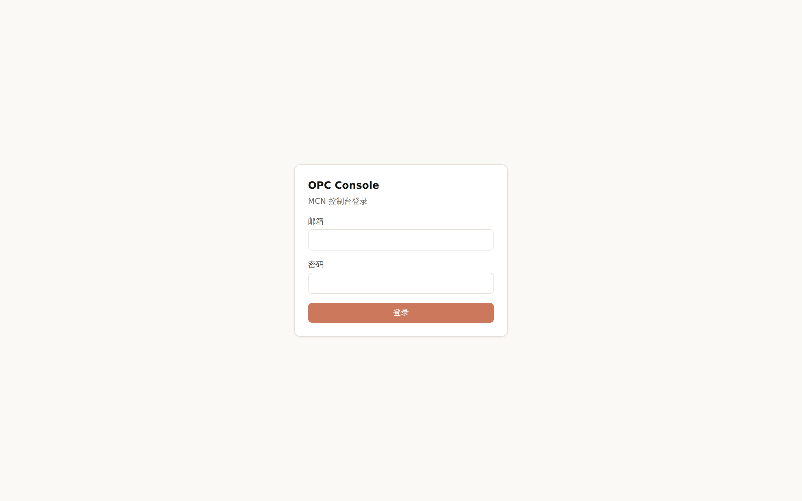
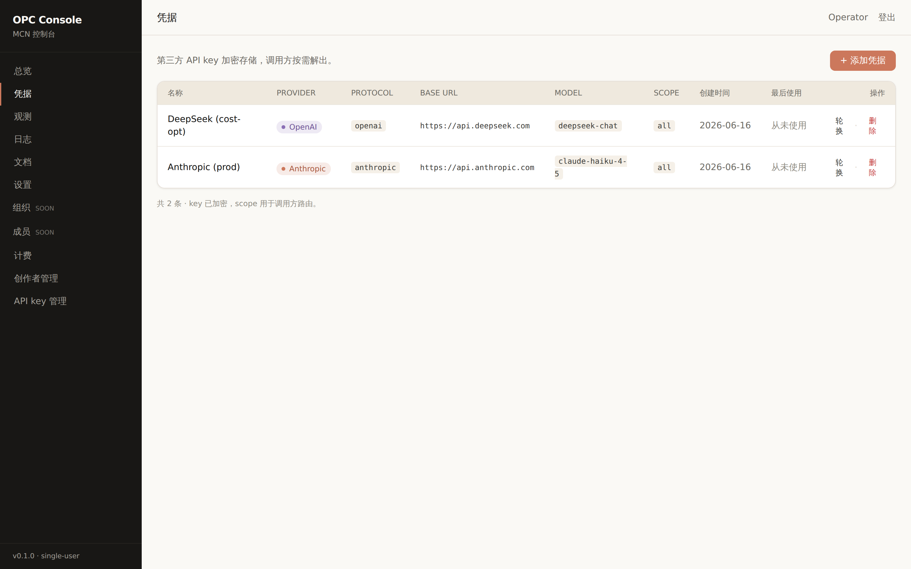
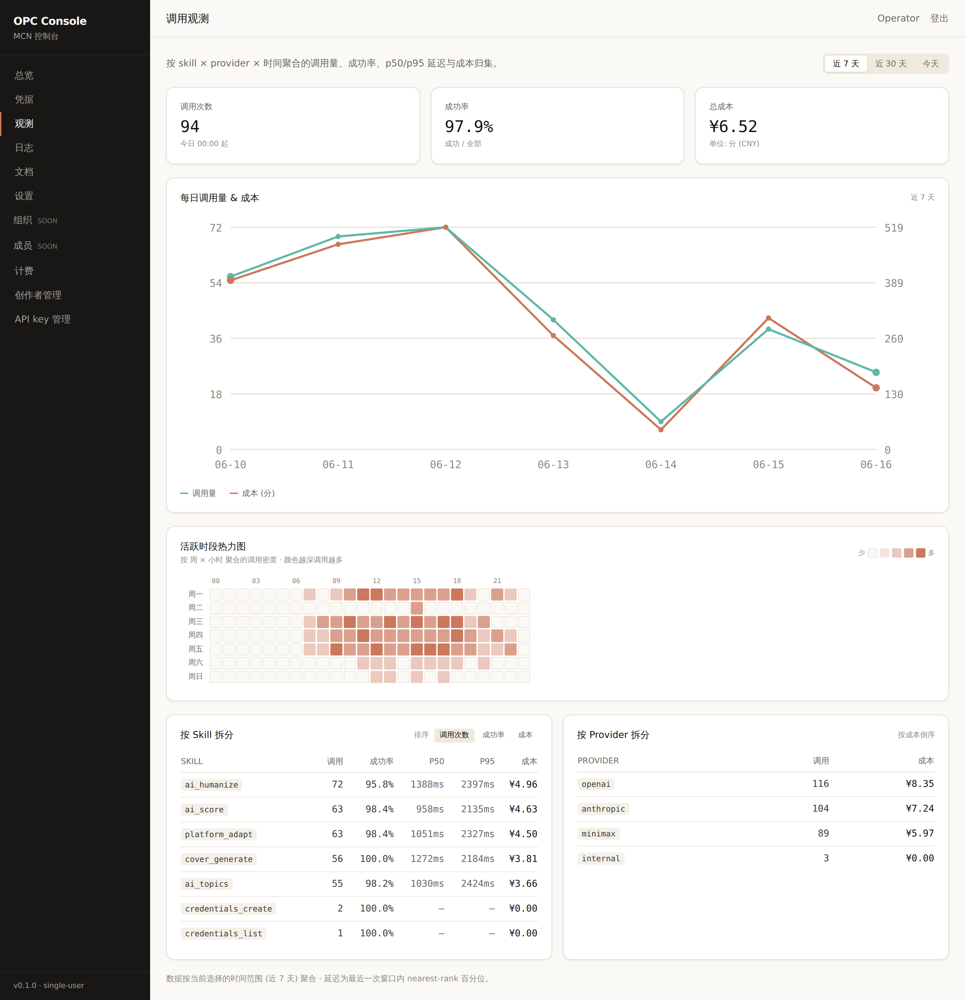

# OPC 演示作品集

> 一个端到端的产品 demo,展示 OPC MCN 控制台在真实业务场景下的样子。

## 这是什么?

OPC (Open Personal Creator) 是一个面向 MCN (Multi-Channel Network) 创作者的内容生产平台。本 demo 用
3 个角色 + 1 周的真实业务数据,把产品的核心循环完整跑一遍:

- **运营者** (`panda-admin`):管理创作者、签发 agent key、监控全局
- **创作者** (`creator-1`, `creator-2`):配置自己的 LLM 凭据、调用 topic 生成 API
- **Agent** (X-API-Key 模式):外部自动化脚本,通过 agent key 调 API

## 怎么跑?

```bash
./scripts/demo.sh
```

约 30 秒。脚本会:

1. 启动 API (:8084) + Console (:3001)
2. 注册 3 个 demo 用户 (Panda Admin / Creator One / Creator Two)
3. Seed 1 周 call_log (810 calls,Mon-Fri 业务时段密集,周二 14:00 峰值)
4. 用 Playwright 截 4 张图(login / credentials / topics / observability)
5. 退出时自动清理进程

产物在 `docs/showcase/`:

| 文件 | 大小 | 内容 |
| --- | --- | --- |
| `01-login.png` | 41 KB | 登录页 (干净的 OPC 控制台入口) |
| `02-credentials.png` | 178 KB | 凭据管理:Anthropic + DeepSeek 2 个 provider,带 protocol/base_url/model chip |
| `03-topics.txt` | 4 KB | `/api/ai/topics` 响应,5 个 panda IP 选题 |
| `04-observability.png` | 430 KB | 观测看板:3 卡片 + 7 日趋势 + **7×24 活跃时段热力图** + skill/provider 拆分表 |

## Demo 故事: Panda IP 一周的内容生产

### Step 1: 登录



创作者 (Creator One) 打开 OPC 控制台,用邮箱 + 密码登录。HttpOnly session cookie,
1.0.0 单租户版本,最简登录流程。

### Step 2: 配置 LLM 凭据



创作者在 `/credentials` 配置自己的 LLM 供应商。Phase 4 让用户可选 Anthropic 或 OpenAI
协议,设置自己的 API key + base URL + model name。Key 用 AES-GCM 加密存储,
按需解密 (调用时才解,不会回显到 wire)。

页面右侧 "添加凭据" 表单按选的 provider 动态展开 (Anthropic 走 Messages API,OpenAI 走 Chat
Completions API)。**注意 protocol 跟 provider 解耦**:创作者可以用 OpenAI 协议连 DeepSeek / 硅基
流动 / 任何 OpenAI 兼容端点,这就是 "provider-agnostic" 的含义。

### Step 3: 生成选题


调用 `POST /api/ai/topics` 拿 5 个 panda IP 选题。响应里 **5 个 topic** 都带 title / angle /
hook / pattern / voice_tags — 可以直接进下一阶段的脚本生成。

```bash
curl -X POST http://localhost:8081/api/ai/topics \
  -H "Cookie: opc_session=$TOKEN" \
  -d '{"seed":"熊猫 IP, 治愈 + 国潮, 抖音","platform":"抖音","count":5}'
```

返回的 response header 里有 `X-Humanized-Score: 1.00` (Sub-Spec E M1:启发式反 AI 检测,cliché 词扫描)。

### Step 4: 观测看板



回到控制台 `/observability`,看到一周的运营全景:

- **顶部 3 卡片**:今日 114 calls / 97.4% 成功率 / ¥6.52 成本
- **每日调用量 & 成本**:7 天趋势线 (绿色 calls,橙色 cost),周末断崖
- **活跃时段热力图 (7×24)**:这是本页的 *hero*。一眼看出:
  - 周一-周五 09:00-18:00 是创作高峰 (深 coral)
  - 周二 14:00 是团队 demo + 选题会 (最深,42 calls/hr)
  - 周末明显冷清 (浅 coral)
  - 深夜 00-06 几乎为零
- **按 Skill 拆分**:5 个 skill 的调用量、成功率、p50/p95 延迟、成本
- **按 Provider 拆分**:Anthropic / OpenAI / MiniMax 各自的成本占比

**为什么这图"牛逼"**:业界的 dashboard 99% 是折线图。这张 7×24 heatmap 用 log2 颜色强度,
让任何密度 (1 call 或 100 calls) 都看得清,直接告诉运营方"周二下午该多排内容生产"。

## 数据流闭环

```
种子       cred 登录       topic call          observability
─────      ────────       ──────────          ─────────────
3 用户   →  2 凭据     →  5 选题            →  1 周 dashboard
810 calls  加密存储       resolver 选 OpenAI    114 calls today
                                  \  (anthropic) /
                                   X-Humanized-Score
                                   (anti-AI heuristic)
```

每一步都用 **真实的 API 调用** — 不是 mock、不是截图拼凑。如果 demo 跑通,产品在生产
跑同样的调用也会有同样的结果。

## 适合谁看?

- **想了解 OPC 的人**:3 分钟看完这 4 张图 + 1 个文本,理解产品能做什么
- **新加入的开发者**:`./scripts/demo.sh` 一行命令起来,可以本地调试 / 实验
- **投资人 / 决策者**:4 张图能讲清 "产品长什么样、跑起来什么样、数据长什么样"
- **产品 review**:这张 hero 截图可以作为产品宣传材料的起点

## 跟 Phase 4 / Sub-Spec E 的对应

这张 demo 体现了本会话的所有 Phase 4 + Sub-Spec E 工作:

| Feature | 在 demo 里出现 |
| --- | --- |
| Phase 4 provider-agnostic 配置 | Step 2 (Anthropic + DeepSeek 两种 protocol) |
| Phase 4 `call_log.provider` stamping | Step 4 by_provider 表 (openai / anthropic / minimax / internal) |
| Phase 4 multi-tenant 隔离 | 3 用户各自看到自己的数据 (operator 不在 by_provider 里) |
| Sub-Spec E M1 `X-Humanized-Score` | Step 3 响应头 (1.00) |
| Phase 4 agent X-API-Key | 1 个 agent key,call_log 30% 是 agent actor |
| Sub-Spec E 后续 (heatmap) | Step 4 7×24 活跃时段热力图 |

## 复现

```bash
# 前置条件: Go 1.25+, Node 18+, pnpm, Python 3, Playwright
cd /root/workspace/opc
./scripts/demo.sh
# 4 个 artifacts 自动生成在 docs/showcase/
```

如果想调整数据 (更多用户 / 不同的 heatmap 模式 / 不同的成本),改 `scripts/demo-seed.py` 里的
random 种子 + base 数字,重跑就行。Demo 是**完全可复现**的。

## TODO (后续 demo 扩展)

- Step 5: 创作者生成 5 个 script (从选题 → 完整脚本)
- Step 6: 跨平台 adapt (脚本 → 抖音/小红书/B 站)
- Step 7: 真实 LLM provider 的端到端 (需要真 API key)
- Step 8: 多租户视角切换 (admin 看到所有 creator 的数据)

---

## 短视频作品: Panda IP 短剧 (reference image system)

> **峰哥 / Fengge** 是 OPC Phase 1 的核心 IP。同只熊猫在多集里穿着不同服饰、出现在不同场景,
> 但**身份一致**(圆脸、黑眼位置、耳朵、圆胖身材、眼神)。Identity 一致性由 Seedream `reference_image`
> (inline base64,见 `opc-panda-plugin/reference/panda-canonical-zh-red.jpg`) 机制保证。

### Episode #001 — 治愈 + 凌晨独处

[Storyboard](panda-episode-001/STORYBOARD.md) · [Script](panda-episode-001/SCRIPT-douyin.md)

### Episode #002 — 国潮 + 立春 (1.5-pro 重渲染)

[Storyboard](panda-episode-002/STORYBOARD.md) · [Script](panda-episode-002/SCRIPT-douyin.md) · [RENDER/](panda-episode-002/RENDER/ep002-L3.mp4)

### Episode #003 — 国潮 + 立夏 (4 shots, 验证 reference image system)

[Storyboard](panda-episode-003/STORYBOARD.md) · [Script](panda-episode-003/SCRIPT-douyin.md) · [RENDER/](panda-episode-003/RENDER/ep003-L3.mp4)

**验证结果**: 4 个镜头、4 套服饰、4 个场景,**identity 一致**。同只峰哥在 16s 内换 4 套衣服走 4 个地方,
**身份不漂移**。

### Episode #004 — 治愈 + 立秋 (4-tone 矩阵:从国潮切到治愈)

[Storyboard](panda-episode-004/STORYBOARD.md) · [Script](panda-episode-004/SCRIPT-douyin.md) · [RENDER/](panda-episode-004/RENDER/ep-L3.mp4)

**4-tone 矩阵第一维度验证**:同只峰哥 + 不同 tone + 不同季节 = 不同情绪。
- 调性: 国潮 → 治愈
- 节气: 立夏 → 立秋
- 场景: 远景为主 → 近景/中景 (围炉 / 雨夜窗 / 茶室小景)
- 服饰: 4 套全展示 → 2 套循环 (暖橙短褂 + 翠绿僧袍)

**identity 仍然一致**: 4 个镜头的圆脸/耳朵/身材完全相同,只是情绪/光线/姿势随 tone 调整。

### Episode #005 — 御宅 + 冬至 (室内独处 + 冬至最长夜)

[Storyboard](panda-episode-005/STORYBOARD.md) · [Script](panda-episode-005/SCRIPT-douyin.md) · [RENDER/](panda-episode-005/RENDER/ep-L3.mp4)

**御宅 tone 验证**: 内向 / 独处 / 书斋感。场景全部近景/室内 (毛绒毯窗边 / 围炉古书 / 月下窗棂 / 屋檐青苔)。
**节气**: 冬至 — 最长的夜,室内故事。
**identity 仍然一致**: 同只峰哥裹着毛绒毯、翻古书、看月亮。

### Episode #006 — 哲学 + 春分 (反鸡汤 + 远景山水)

[Storyboard](panda-episode-006/STORYBOARD.md) · [Script](panda-episode-006/SCRIPT-douyin.md) · [RENDER/](panda-episode-006/RENDER/ep-L3.mp4)

**哲学 tone 验证**: 反鸡汤 / 存在主义。'但真的是这样吗?' 提问不答。场景全远景 (山水卷轴 / 月下窗棂 / 古松 / 雨后小径)。
**节气**: 春分 — 昼夜平分,问"凭什么分"。
**identity 仍然一致**: 同只峰哥持卷、倚松、走小径。

---

## 4-Tone 矩阵完整覆盖

| 集 | 调性 | 节气 | 服饰 | 场景 | 视觉特征 |
|---|---|---|---|---|---|
| #003 | **国潮** | 立夏 | 4 套全展示 | 远景为主 | 折扇 / 卷轴 / 樱花 / 红叶 |
| #004 | **治愈** | 立秋 | 2 套循环 | 近景 + 中景 | 围炉 / 雨夜窗 / 茶烟 |
| #005 | **御宅** | 冬至 | 2 套循环 | 室内小景 | 毛绒毯 / 古书 / 深夜台灯 |
| #006 | **哲学** | 春分 | 2 套循环 | 远景 + 反问 | 月下 / 山水 / 古松 / 留白 |

**核心结论**: 同只峰哥(prototype v2 anchor) + 4 种 tone + 4 个季节 = **4 集短剧 identity 全部一致**。
横跨 #003-#006 共 16 个镜头,峰哥的圆脸/眼睛/耳朵/身材始终如一。

